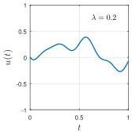
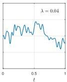
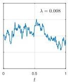
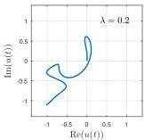
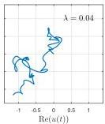
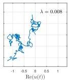

SMOOTH RANDOM FUNCTIONS

Fig. 6 Indefinite integrals of big smooth random functions give smooth random walks, which converge to Brownian paths as  $\lambda \to 0$ .

Fig. 7 A complex analogue of Figure 6 shows indefinite integrals of big smooth complex random functions, that is, smooth random walks in two dimensions.

of the same random curve.2 One sees smaller-scale features appearing as  $\lambda$  decreases and more terms are included in the series (2.2). We call such paths smooth random walks, and as we shall state in Theorem 4.3 below, they converge to Brownian paths as  $\lambda \to 0$ . One of our favorite references on mathematical Brownian motion is [32].

Figure 7 presents an analogous trio of images for indefinite integrals of complex smooth random functions. These we call complex smooth random walks, again converging to a familiar form of complex (or simply two-dimensional) Brownian paths as  $\lambda \to 0$ .

Each sample path of a random process looks different (and it is striking how the human eye is wired to see personalities in them!). Figure 8 shows ten examples each of smooth real and complex random walks, all with  $\lambda = 0.001$ . Taking smaller values of  $\lambda$  would have little visible effect. In Chebfun, one can generate a figure like this with the command plot(cumsum(randnfun(.001, [0 1], 10)))

The mathematics of Brownian paths began to be worked out by Einstein, Smoluchowski, and others in the first decade of the 20th century. The core of this subject is the idea that Brownian paths are the integral of white noise, i.e., of a signal with equal energy at all wave numbers. The paradox is that the notion of white noise does not make sense, because for noise to be truly white, it would have to have infinite