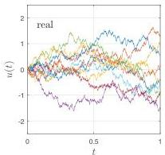
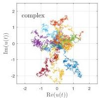

SILVIU FILIP, AURYA JAVEED, AND LLOYD N. TREFETHEN

Fig. 8 Real and complex smooth random walks, ten samples each with  $\lambda = 0.001$ . This value is small enough that the curves are Brownian paths roughly to plotting accuracy.

amplitude and infinite energy. In a physical application, noise must be colored. There must be a cutoff, a minimal space scale, and in the case of physical Brownian motion of the kind observed in microscopes, this is provided by the finite size of the molecules that randomly impact a small particle suspended in a liquid.

In the 1920s, nevertheless, Wiener found a way to make the notion of Brownian paths rigorous without a small space scale cutoff: in our terms, to set  $\lambda = 0$ . (Other mathematicians important in the early history include Kolmogorov and Levy.) The essential idea is to take as the primary object not noise but its integral—the Brownian path. Wiener showed that one can define such paths and the associated probability measure in a mathematically rigorous way, giving what is now known as the Wiener process. A Brownian path  $W(t)$  is continuous (with probability 1), but it is not smooth. Its derivative exists nowhere (again with probability 1), which is to be expected since the derivative would have to be white noise.

A remarkable property of Brownian paths is that, although the details of a path from A to B are infinitely complicated, it is possible to get from A to B without tracking those details. A random walk with finite steps taken from a normal distribution can be regarded as a sample of a Brownian path at discrete times, and if one needs values at points in between, one can calculate them later (the Brownian bridge). Using a term from computer science, we may say that the infinite complexity of Brownian paths is not an obstacle because they can be computed by "lazy evaluation."

The most fundamental virtue of the pointwise approach to stochastic analysis initiated by Wiener is that, scientifically speaking, it is just the right idealization. By way of analogy, the subject of continuum mechanics builds on the fact that although the air in a pump, say, is composed of a vast number of discrete molecules, it can be modeled as a continuum. We know that air is not really a continuum, yet most of us would feel that interpreting it that way is not merely convenient, but in some sense intellectually the right thing to do for many purposes. The pointwise,  $\lambda = 0$  approach to stochastic analysis has the same quality. Truly white noise may be a physical impossibility, but we can make sense of its integral, and this seems intellectually right. And just as with continuum mechanics, this model of stochastics has the particular benefit that it connects the subject with PDEs. For example, the theory of harmonic