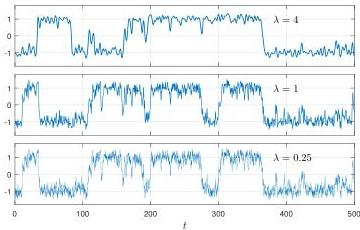

SILVIU FILIP, AURYA JAVEED, AND LLOYD N. TREFETHEN


Fig. 9 Solutions to the bistable ODE with noise (5.1) for three values of  $\lambda$ , all starting from the same random number seed. The solution alternates randomly between one state and the other.

malization, when one is interested in systems with a macroscopic random character, as illustrated in a PDE context by the Cahn-Hilliard example of Figure 3. Other times the motivation is noise, and then the right choice will be small values of  $\lambda$  with the big normalization. For example, the smooth random walks of the last section are solutions of the trivial ODE  $u' = f$ , where  $f$  is a big smooth random function. It is equally easy on a computer to incorporate smooth random functions in less trivial differential equations.

First, Figure 9 shows three solutions to a bistable equation with noise,

(5.1)  $u^{\prime} = u - u^{3} + 0.7f,\quad t\in [0,500],u(0) = -1,$

where  $f$  is a big smooth random function with wavelength parameter  $\lambda$ . Without the noise term, this ODE has stable steady states at  $u = -1$  and  $+1$ . With the noise, solutions tend to linger near one steady state before eventually making a transition to the other (essentially a Poisson process), switching back and forth infinitely often (with probability 1) as  $t \to \infty$ . In Chebfun, a suitable code is

```txt
f = randnfun( lambda, [0 500], 'big');
N = chebop(0,500);
N.op = @(u) diff(u) - u + u^3 + .5*f; N.1bc = -1;
u = N\0; plot(u)
```

The figure plots solutions for three values of  $\lambda$ , revealing modest changes as  $\lambda$  decreases. In a scientific application one might be interested, for example, in the dependence of the mean switching time on the noise amplitude.

The next example, in Figure 10, is a nonlinear pendulum equation with noise,

(5.2)  $\theta'' = -\sin(\theta) + 0.05f, \quad t \in [0,200], \theta(0) = 3, \theta'(0) = 0,$

where  $f$  is a big smooth random function with  $\lambda = 0.2$ . In Chebfun: