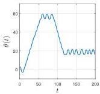
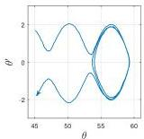
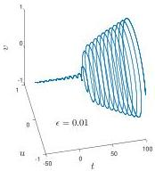
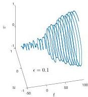

SMOOTH RANDOM FUNCTIONS


Fig. 10 The nonlinear pendulum with noise (5.2), showing a function of time  $t$  on the left and the corresponding phase plane trajectory for  $47 \leq t \leq 97$  on the right. The noise induces transitions between bound states, in which  $\theta(t)$  oscillates around a multiple of  $2\pi$ , and unbound states, where the pendulum swings over and  $\theta(t)$  increases or decreases steadily.




Fig. 11 Hopf bifurcation with noise in (5.3). With small noise (left), the bifurcation point is near  $t = 0$ , but larger noise (right) brings it forward.



```txt
N = chebop(0,200);
N.op = @(theta) diff(theta,2) + sin(theta); N.lbc = [3;0];
f = .05*randnfun(0.2,[0 200], 'big');
theta = N\f; plot(theta)
```

Without the noise, the trajectory would oscillate forever around 0, but the noise has the effect of increasing the energy so that  $\theta$  increases steadily up to around  $t = 60$ ; the pendulum is swinging over and over. Then the energy happens to diminish a bit, giving a couple of bound oscillations, before at around  $t = 90$  it increases again and the pendulum starts swinging over in the other direction. As in all such experiments, a new choice of  $f$  would change the details completely, but it would not change the qualitative behavior.

Our third example in Figure 11 concerns a Hopf bifurcation in a two-variable ODE system that can be found in a number of references; we adapted this from Example 79