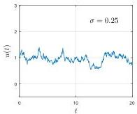
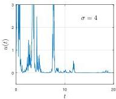

SILVIU FILIP, AURYA JAVEED, AND LLOYD N. TREFETHEN


Fig. 12 Solutions to the multiplicative noise equation (5.4) for small and large values of  $\sigma$ , both with  $\lambda = 0.05$ . As analyzed in [20], the two behaviors are qualitatively different.



of Appendix B of [47]. The equations are

$$
u ^ {\prime} = - v + u \left(t / T - u ^ {2} - v ^ {2}\right) + \varepsilon f, \quad v ^ {\prime} = u + v \left(t / T - u ^ {2} - v ^ {2}\right), \tag {5.3}
$$

where  $f$  is a big smooth random function with  $\lambda = 1$ . With  $\varepsilon = 0.01$ , a bifurcation occurs near  $t = 0$ , as one would expect from a standard analysis, but the larger value  $\varepsilon = 0.1$  advances the bifurcation point noticeably:

```txt
T = 100; dom = [-T,T];
N = chebop(@(t,u,v) [diff(u)*v-u*(t/T-u^2-v^2); ... diff(v)-u-v*(t/T-u^2-v^2)],dom);
N.lbc = [0;0]; rng(0), f = 0.01*randnfun(1,dom,'big');
[u,v] = N\[f;0]; t = chebfun('t',dom); plot3(t,u,v,LW,lw)
```

All these examples involve what is known as additive noise, where a random term is added to an ODE as a forcing function. Smooth random functions can also be used to approximate multiplicative noise. In the simplest case the ODE is  $u' = fu$ , where  $f$  is a big smooth random function, and this leads to a smooth approximation of geometric Brownian motion. For a more substantive example we follow Horsthemke and Lefever [20, p. 123] and consider the equation

$$
u ^ {\prime} = (1 + \sigma f) u - u ^ {2}, \quad t \in [ 0, 2 0 ], u (0) = 1, \tag {5.4}
$$

where  $f$  is a big random function. With  $\sigma = 0$ , this system has a stable fixed point at  $u = 1$  and an unstable one at  $u = 0$ . With  $\sigma \neq 0$ , as analyzed in [20], the trajectories stay mainly near  $u = 1$  when  $\sigma$  is small but are often near  $u = 0$  when  $\sigma$  is large. Figure 12 illustrates this difference.

None of what we have done in this section has made use of the theorems, notations, or algorithms of stochastic calculus and SDEs. Everything has involved ODEs of the usual kind computed by the usual numerical methods, so no technical issues have arisen. But of course it is necessary to know how computations like these relate to stochastic analysis. There are two standard formulations, originating with Ito (in the 1940s) and Stratonovich (in the 1960s). The mathematical relationships between the Ito and Stratonovich formulations are fully understood, and an equation written in either form can be converted into an equivalent equation in the other; when there