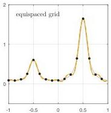
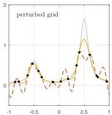

SMOOTH RANDOM FUNCTIONS

Fig. 13 Gaussian process interpolation of  $2\mu + 1$  data values with  $\mu = 8$  by a trigonometric polynomial of degree  $m = 16$ : equispaced sample points on the left, perturbed sample points on the right. (The data are samples of  $f(x) = \exp (\sin (\pi x)) / (1 + 10\cos^2 (\pi x))$ , shown in gray.) The dashed curves correspond to the Dirichlet kernel that is the basis of smooth random functions as defined in this article, and the continuous curves to a periodic Gaussian kernel. The latter is better for this kind of application because it is biased toward low wave numbers rather than treating all wave numbers below a certain cutoff equally.

noise), and it uses a Gaussian kernel by default. In the periodic case, the kernel is made periodic in a fashion proposed in [29].

7. Smooth Random Functions in Multiple Dimensions. Smooth random functions are readily generalized to multiple dimensions; we focus on the two-dimensional case for concreteness. The new issue that arises here is that as well as being stationary, one would like the distribution to be isotropic. We achieve this by taking a finite bivariate Fourier series with random coefficients in a ball, not a square, of wave numbers:

$$
f (x, y) = \sum_ {k = - m} ^ {m} \sum_ {j = - m _ {k}} ^ {m _ {k}} c _ {j k} \exp \left(\frac {2 \pi i (j x + k y)}{L}\right), \quad m _ {k} = \sqrt {m ^ {2} - k ^ {2}}. \tag {7.1}
$$

(For random functions on a rectangle, the ball becomes an ellipse.) This provides approximate isotropy for finite  $m$ , improving as  $m \to \infty$ . The analogue of a Gaussian process in multiple dimensions is called a Gaussian random field, and stationarity together with isotropy amount to the condition that the covariance function  $C(\mathbf{x},\mathbf{x}^{\prime})$  depends only on  $||\mathbf{x} - \mathbf{x}^{\prime}||$ .

Random functions have been employed for a wide variety of scientific applications, and there has been great interest in elucidating their properties. Early work on the one-dimensional case was due to Steve Rice [40] during World War II, motivated by applications such as shot noise in signal processing, and two-dimensional random functions were investigated a decade later by Longuet-Higgins in an analysis of ocean waves [27]. In cosmology, three-dimensional random functions have been investigated to shed light on the distribution of galaxies in the universe and the structure of the cosmic microwave background; a celebrated paper in this area is that of Bardeen et al. [3]. "Random energy landscapes" are a basic notion in fields including condensed matter physics [7], and string theorists are considering random functions in a higher-dimensional parameter space as a model to explain how a universe such as our own may