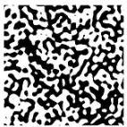
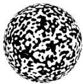

SILVIU FILIP, AURYA JAVEED, AND LLOYD N. TREFETHEN

Fig. 14 Random functions with  $\lambda = 0.1$  on the square  $[-1,1]^2$  and the unit sphere computed with randnfun2 and randnfun sphere in Chebfun. The "zebra" plotting mode shows positive and negative values as white and black, respectively.

have arisen [7, 13]. Bowen, Strong, and Golden have investigated random functions in two dimensions as models of the fractal geometry of Arctic melt ponds [6], and for random functions in biology, see [44]. Mathematicians have also investigated properties of random functions extensively, and a leader in this area has been R. Adler [1, 2]. In this context random functions can be considered not just in Euclidean space but also on manifolds.

A particularly down-to-earth example of a manifold is the unit sphere, and to construct smooth random functions on this domain, one can use a spherical harmonic series with random coefficients. For isotropy, it is appropriate to use coefficients in a triangular array:

$$
f (\varphi , \theta) = \sum_ {\ell = 0} ^ {m} \sum_ {j = - \ell} ^ {\ell} c _ {\ell , j} Y _ {\ell , j} (\varphi , \theta). \tag {7.2}
$$

Here,  $\varphi$  is longitude,  $\theta$  is colatitude (i.e.,  $\pi /2$  minus the latitude), and  $Y_{\ell ,j}$  denotes the spherical harmonic of degree  $\ell$  and order  $j$ ,

$$
Y _ {\ell , j} (\varphi , \theta) = P _ {\ell} ^ {j} (\cos (\theta)) e ^ {i j \varphi},
$$

where  $P_{\ell}^{j}$  is the (normalized) associated Legendre function. Since the circumference of the unit sphere is  $L = 2\pi$ , we take  $m = \lfloor 2\pi /\lambda \rfloor$  in analogy to (2.1) [26]. In Chebfun, smooth random functions on the sphere have been implemented by Grady Wright using Spherefun [45].

We shall not give further details of multidimensional smooth random functions but illustrate the subject in Figures 14 and 15. Incidentally, for dimensions greater than 1, there is an alternative notion of smooth random function of interest to physicists: a Fourier series in which all wave number vectors are  $= \lambda$  rather than just  $\leq \lambda$  in magnitude for some  $\lambda &gt; 0$ ; the orientations of the waves, however, are not fixed. We call these monochromatic smooth random functions, and they arise in the study of quantum chaos as models of random high energy eigenfunctions of the Laplace operator [4, 5, 33]. In Chebfun, one can write, e.g., randnfun2( lambda, 'mono').

8. Discussion. Our "standard" smooth random functions are Gaussian processes (or Gaussian random fields in multiple dimensions), but for simplicity they are very simple ones, defined by a finite Fourier series with random coefficients, all from the same normal distribution. This is certainly not the only reasonable choice, but we