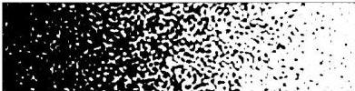

SMOOTH RANDOM FUNCTIONS

Fig. 15 This image, which reminds the authors of the engravings of M. C. Escher, is a zebra plot of the function  $x + f$  on the rectangle  $-2 \leq x \leq 2$ ,  $0 \leq y \leq 1$ , where  $f$  is a 2D random function with  $\lambda = 0.05$ . The properties of surfaces like these have been investigated for applications in fields including cosmology, condensed matter physics, oceanography, climate modelling, image processing, and pure mathematics.

offer it for simplicity and concreteness, to emphasize that useful explorations can be carried out without requiring the user to first confront the possibly daunting question, "what is your covariance function?" Many applications will involve some smoothing—the Cahn-Hilliard equation of Figure 3, for example—and in such cases the choice of covariance function may not matter much anyway.

Our "big" smooth random functions are the same, except with a different normalization appropriate to taking integrals to model stochastic effects. Again, our aim has been simplicity. The usual foundation of stochastic analysis among mathematicians is a pointwise conception of noise, as discussed in section 4, even though, if white noise truly took values at points, they would have to be discontinuous and of infinite amplitude. The use of smooth random functions follows the alternative approach of conceiving noise as smooth and finite, with a small wavelength parameter  $\lambda &gt; 0$ . This offers a way to explore stochastic effects without employing the special definitions of stochastic calculus (Ito, Stratonovich) or the associated special SDE algorithms (Euler-Maruyama, Milstein,...). As recorded in Theorem 5.1, this corresponds to the Stratonovich calculus as  $\lambda \to 0$ , at least in cases with a single random variable.

As we stated at the outset, none of the ingredients we have put together are new. Fourier series with random coefficients have been investigated for a century, the idea of band-limited white noise is a familiar one, and many variations on these themes have been exploited for a wide range of scientific and engineering problems.

We emphasize that we do not advocate smooth random functions for reasons of computational efficiency. On the contrary, existing algorithms of stochastic computation will be faster in many cases and, in particular, working with smooth random functions with  $L / \lambda \gg 1000$  is unwieldy in Chebfun. The point of smooth random functions is conceptual and computational simplicity, not speed. Indeed, even in the realm of approximating Brownian paths and SDEs via random ODEs with smooth coefficients, more accurate approximations are possible with the use of alternative random Fourier series derived from the Karhunen-Loève expansion [53].

Although this presentation has avoided the details of stochastic analysis, there is no doubt that these are indispensable for a full understanding of stochastic effects—starting with the fundamental distinction between the Ito and Stratonovich integrals. The perspective of this paper is that, given the associated technical challenges, perhaps there is a place for simpler tools too. Imagine if we told students they had to learn measure theory before they could talk about integrals!