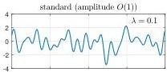
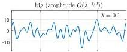
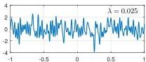
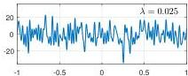

SILVIU FILIP, AURYA JAVEED, AND LLOYD N. TREFETHEN

Fig. 1 Smooth random functions on  $[-1,1]$  with wavelength parameters  $\lambda = 0.1$  and 0.025. The two columns look the same at first glance, but their vertical scales are different, illustrating that two different choices of normalization are appropriate depending on whether one is concerned with function values (left column) or their integrals (right). In Chebfun, these functions can be generated by the commands randnfun(1ambda) and randnfun(1ambda, 'big'), respectively.

Our definitions allow the domain to be any interval  $[a, b]$ , and extensions to multiple dimensions are presented in section 7.

Nothing in this article is mathematically or scientifically new. The idea of Fourier series with random coefficients ("Fourier-Wiener series") goes back to Wiener in 1924 [48], with generalizations by Paley, Wiener, and Zygmund in 1933-34 [36]. A leader in this subject for many years was Jean-Pierre Kahane [21, 22], and there is an advanced monograph by Marcus and Pisier [30]. Random series have been used extensively for time series analysis [17], computational simulations [54], and theoretical applications in a range of fields, both in one and in higher dimensions (see section 7). Our aim in this paper is to present this idea in the form of a very concrete, easily accessible tool that may be useful for those learning or exploring random phenomena. Rather than starting with technicalities of Gaussian processes or SDEs, we go directly to the smooth random functions, while giving references to published sources for fuller and more rigorous treatments.

A key feature of this paper is a sequence of Chebfun-based examples illustrating how smooth random functions can be used in applications. Further examples can be found in Chapter 12 of [47], where these functions were first introduced, and in the online examples collection at www.chebfun.org.

2. Periodic Smooth Random Functions. Let  $\lambda &gt; 0$  be a wavelength parameter, and suppose we are interested in periodic random functions on the interval  $[-L/2, L/2]$  for some  $L &gt; 0$ ; an interval  $[a, b]$  is handled by the obvious translation. Our definitions based in the Fourier domain are as follows. In a moment we shall give equivalent definitions based in the space domain.

DEFINITION 2.1. A complex periodic smooth random function for given  $\lambda, L &gt; 0$  is a function

$$
f (x) = \sum_ {j = - m} ^ {m} c _ {j} \exp \left(\frac {2 \pi i j x}{L}\right), \quad m = \lfloor L / \lambda \rfloor , \tag {2.1}
$$

where each  $c_{j}$  is an independent sample from  $N(0,1 / (2m + 1)) + iN(0,1 / (2m + 1))$ . A