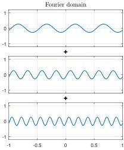
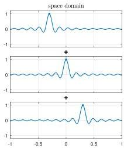

SILVIU FILIP, AURYA JAVEED, AND LLOYD N. TREFETHEN

Fig. 2 Two ways of viewing a smooth random function  $f$ . The Fourier domain view is that  $f$  is a linear combination of a finite collection of sine waves with different wave numbers and phases. The space domain view is that it is a trigonometric interpolant through random data values at equally spaced points or, equivalently, a linear combination of translates of the Dirichlet kernel (the periodic sinc function). Each column of this figure is intended to suggest how the random function is obtained by adding up such pieces.

where the equispaced gridpoints  $x_{j}$  are defined by

$$
x _ {j} = j h, \quad h = \frac {L}{2 m + 1}, \quad - m \leq j \leq m. \tag {2.3}
$$

If  $\mathbf{c} = (c_0, \ldots, c_m, c_{-m}, \ldots, c_{-1})^T$  and  $\mathbf{d} = (d_0, \ldots, d_m, d_{-m}, \ldots, d_{-1})^T$ , then  $\mathbf{d} = F\mathbf{c}$  where  $F$  is the  $(2m + 1) \times (2m + 1)$  discrete Fourier transform matrix

$$
F = \left( \begin{array}{c c c c} 1 &amp; 1 &amp; 1 &amp; \dots \\ 1 &amp; \omega &amp; \omega^ {2} &amp; \dots \\ 1 &amp; \omega^ {2} &amp; \omega^ {4} &amp; \dots \\ \vdots &amp; \vdots &amp; \vdots \end{array} \right), \quad \omega = \exp \left(\frac {2 \pi i}{2 m + 1}\right).
$$

This matrix, mapping coefficients to function values, is  $\sqrt{2m + 1}$  times a unitary matrix. In other words its inverse, mapping function values to coefficients, is  $F^{-1} = (2m + 1)^{-1}F^{*}$ , where  $*$  denotes the conjugate transpose.

Thus there are two equivalent ways to specify a  $(2\pi /\lambda)$ -band-limited  $L$ -periodic function: as a linear combination of  $2m + 1$  Fourier modes, or as the unique trigonometric interpolant through  $2m + 1$  data values. The idea of Lagrange interpolation gives an explicit representation of such interpolants. The function

$$
D (x) = \frac {\sin ((2 m + 1) \pi x / L)}{(2 m + 1) \sin (\pi x / L)} \tag {2.4}
$$

is the trigonometric interpolant through the data values 1 at  $x = 0$  and 0 at the other  $2m$  points  $x_{j}$ ,  $j \neq 0$ . (It is equal to the sum (2.1) in the case  $c_{j} = (2m + 1)^{-1}$  for all  $j$ .) Thus  $D$  is the cardinal function associated with interpolation through a single