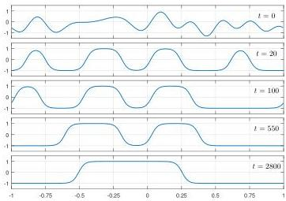

SILVIU FILIP, AURYA JAVEED, AND LLOYD N. TREFETHEN


Fig. 3 Solution of the Cahn-Hilliard equation (2.6) with a smooth periodic random function with  $\lambda = 0.2$  as the initial condition  $u(x,0)$ . As  $t$  increases, the solution coalesces into fewer and fewer regions with values  $\approx \pm 1$ , always conserving the overall integral, until eventually a steady state is reached with just one region of each sign in this periodic domain. Smooth random functions are employed in applications for exploring the typical behavior of a dynamical system. As we shall see in section 7, sometimes that system may be the universe itself.

behavior of a system. The figure shows a computation in which a periodic smooth random function has been taken as the initial condition for the Cahn-Hilliard equation,

$$
u _ {t} = - 1 0 ^ {- 2} u _ {x x} - 1 0 ^ {- 5} u _ {x x x x} + 1 0 ^ {- 2} \left(u ^ {3}\right) _ {x x}, \tag {2.6}
$$

which models phase separation in binary alloys and fluids [8]. We take periodic boundary conditions on the interval  $x \in [-1, 1]$  for  $t \in [0, 3000]$ , and the simulation is carried out with the "spin" stiff partial differential equation (PDE) integrator in Chebfun [31] in about 15 seconds of laptop time using essentially the following code:

```matlab
S = spinop([-1,1], [0 3000]);
rng(6), S.init = -.5*randnfun(.2, 'trig');
S.lin = @(u) -1e-2*diff(u,2) - 1e-5*diff(u,4);
S.nonlin = @(u) 1e-2*diff(u.^3,2);
spin(S,96,.04, 'iterplot',250)
```

3. Nonperiodic Smooth Random Functions. The random functions discussed above are periodic, but applications usually do not call for periodicity. As a practical matter, we construct nonperiodic smooth random functions by forming periodic functions on a longer interval  $[-L'/2, L'/2]$  or  $[0, L']$  with  $L' &gt; L$  and then truncating. In principle one should take  $L' \to \infty$ , so that no trace of periodicity remains in the original interval. A mathematically precise treatment of this limit would involve random Fourier transforms as opposed to series, but we shall not pursue this. Accordingly,