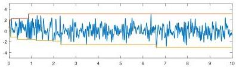

SMOOTH RANDOM FUNCTIONS

Fig. 4 A smooth random function with  $\lambda = 0.05$  on [0,10] together with its cumulative maximum and minimum functions. With probability 1, these widen at a rate proportional to  $(\log L)^{1/2}$  on  $[0,L]$  as  $L \to \infty$ .

in the remainder of this paper, when we speak of smooth random functions without specifying periodicity, we refer to a construction based on a finite value  $L' \geq L$ . Informally, one should imagine  $L' \gg L$ , or more precisely  $L' - L \gg \lambda$ , but formally, our statements apply irrespective of the choice of any finite value  $L' \geq L$ . The Chebfun randnfun function takes  $L' \approx 1.2L$ . Any fixed ratio  $L'/L &gt; 1$  is enough to ensure that effects of periodicity go away as  $\lambda \to 0$ .

Smooth random functions have many properties that mimic those of the random vectors  $\text{randn}(\mathfrak{n},1)$  mentioned in the introduction. For example, Figure 4 shows a smooth random function with  $\lambda = 0.05$  on the domain [0,10] produced by the Chebfun command  $\mathbf{f} = \text{randnfun}(0.05, [0,10])$ . What are its maximum and minimum? Approximately speaking, both numbers will be of order 1, and more precisely, for any fixed  $\lambda$ , according to the theory of extreme value statistics, one can expect them to grow at a rate proportional to  $(\log L)^{1/2}$  on  $[0,L]$  as  $L \to \infty$  because of the square-exponential tail of the normal distribution. (A key mathematical result in this area is the Borell-TIS inequality [1].) The figure gives some hint of this behavior by including cumulative minimum and maximum curves drawn by the Chebfun command plot([f; cummax(f); cummin(f)]). One could investigate precise formulations of such observations, and that would be an interesting subject for research. As is customary in probability theory, properties of smooth random functions will hold not with certainty, but with probability 1. For example, a smooth random function for any fixed  $L$  and  $\lambda \leq L$  is nonconstant—with probability 1.

Another example of the kind of exploration that is readily carried out with nonperiodic smooth random functions is illustrated in Figure 5. If  $f$  and  $g$  are real functions of  $t$ , then for any  $\varepsilon &gt; 0$  and any  $t$ , the symmetric matrix

$$
A (t) = \left( \begin{array}{c c} f (t) &amp; \varepsilon \\ \varepsilon &amp; g (t) \end{array} \right) \tag {3.1}
$$

has two distinct real eigenvalues (separated by at least  $2\varepsilon$ ). If  $\varepsilon$  is small, however, the two eigenvalues will have a near-crossing at points where  $f$  and  $g$  cross. The figure illustrates this effect for a case where  $f$  and  $g$  are smooth random functions on  $[0,4]$  with  $\lambda = 1$  and  $\varepsilon = 0.05$ . A generalization of this example, which goes by the name of Dyson Brownian motion [12], is the effect that real symmetric matrices with Brownian path entries also show eigenvalue level avoidance (with probability 1).

4. Big Smooth Random Functions, White Noise, and Brownian Paths. The tempting question is always, what happens as  $\lambda \to 0$ ? This is the white noise limit, but one must be careful.