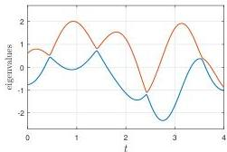

SILVIU FILIP, AURYA JAVEED, AND LLOYD N. TREFETHEN

Fig. 5 Eigenvalues of a  $2 \times 2$  real symmetric matrix function (3.1) with smooth random entries, related to the process known as Dyson Brownian motion. When the values of  $f(t)$  and  $g(t)$  cross, the eigenvalues come close together but do not cross.

Smooth random functions as we have defined them oscillate faster and faster as  $\lambda \to 0$ , always with amplitude  $O(1)$ . They do not converge pointwise. One might imagine that a reasonable notion of a random function corresponding to  $\lambda = 0$  would be a function taking independent values from  $N(0,1)$  at each point  $x$ . Such functions would not be Lebesgue measurable, however, and hence would not even be integrable; it is not clear what use they would be.

Another idea for  $\lambda \to 0$  comes from the observation that integrals of smooth random functions converge to zero in this limit because of sign cancellation. So one could also speak of a limit function for  $\lambda = 0$  in the form of a distribution. It would be the zero distribution, however, which is not very interesting.

The mathematical and scientific substance for the limit  $\lambda \to 0$  appears when the functions are rescaled by  $O(\lambda^{-1/2})$ . The precise definition we make is that a smooth random function in the "big" normalization is the same as before, but with (2.1), (2.2), and (2.5) multiplied by  $\sqrt{2/\lambda}$ . Here are the definitions followed by the appropriate restatement of Theorem 2.2.

DEFINITION 4.1. A real or complex big periodic smooth random function is defined as in Definitions 2.1 and 2.3, except with the variances  $1 / (2m + 1)$  of Definition 2.1 increased to  $2 / ((2m + 1)\lambda)$  and the variances 1 of Definition 2.3 increased to  $2 / \lambda$ .

THEOREM 4.2. A big periodic smooth random function  $f$  (whether real or complex) is  $L$ -periodic, entire, and  $(2\pi/\lambda)$ -band-limited. The stochastic process from which  $f$  is a sample is stationary, with values  $f(x)$  at each  $x$  distributed according to  $N(0,2/\lambda) + iN(0,2/\lambda)$  in the complex case and  $N(0,2/\lambda)$  in the real case.

Note that since  $m \approx L / \lambda$ , we have  $2 / ((2m + 1)\lambda) \approx 1 / L$ . Thus in the big normalization, the random coefficients of the series (2.1) and (2.2) have variances essentially independent of  $\lambda$  as  $\lambda \to 0$ .

The point of the rescaling emerges when we look at integrals. Figure 6 plots indefinite integrals of three big smooth random functions on  $[0,1]$  with parameters  $\lambda = 1/5$ ,  $1/25$ , and  $1/125$ . The seed used to initialize the random number generator is set in the same way for each case, so these are successively finer approximations